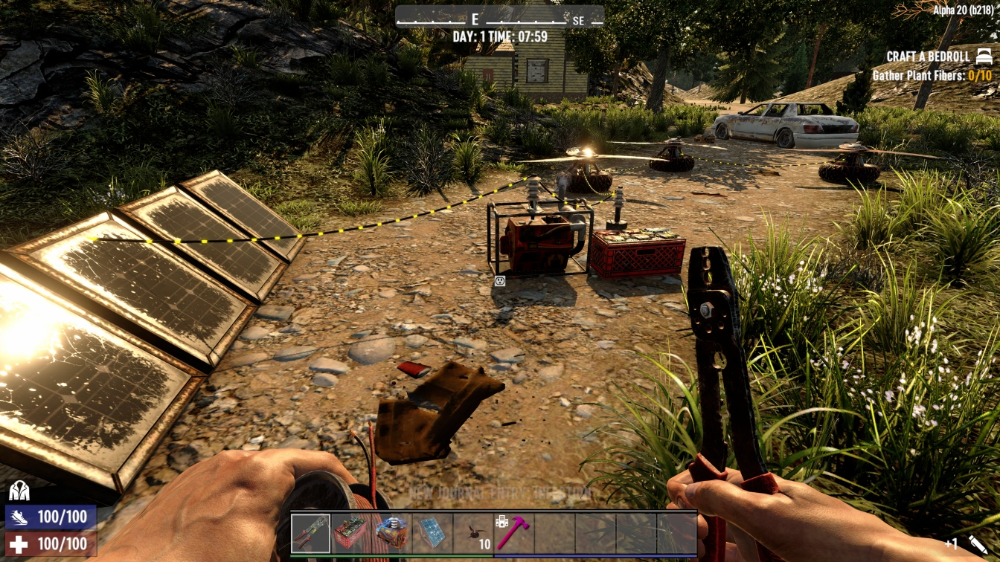
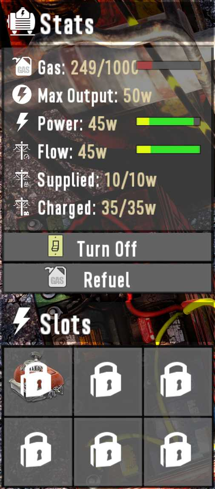
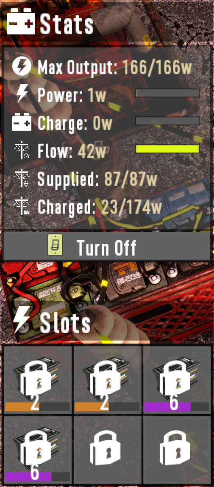
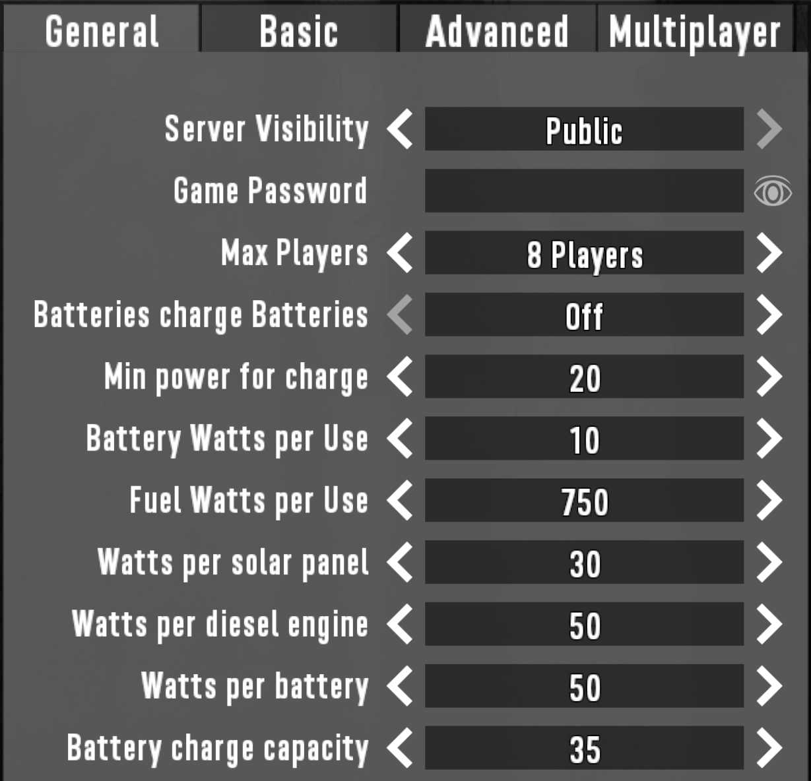

# OCB Electricity Overhaul Mod - 7 Days to Die (V1.0) Addon

Electricity done better! Enables to connect multiple power sources to
each other. Every power item can still only have one parent connection
though, but it can lend power from multiple upstream sources that
are connected in line. Also preserves pass-through trigger groups.



[![GitHub CI Compile Status][3]][2]

## Main features

- Power sources can be connected like every other power item
- Power can be taken from any upstream power source
- Prioritize renewable energy before using gasoline
- Additional grid demand/supply and charge statistics
- Batteries are all charged/discharged when in a bank
- Solar power gradually fades in and out at dawn and dusk
- Decide from which upstream power types to charge batteries

<p>
    
    
    
    <br clear="left"/>
</p>

For the extended power source info to work for multiplayer, you will need
[OcbRemoteDescription][4] to be installed on the server and each client.

## Additional mods (pick the ones you like)

These mods are all additional mods that have been tested with this mod.
But the also work on their own. Therefore pick the ones you like and
install them additionally to the Electricity Overhaul mod.

Note for A21 update: Not everything has been ported and tested yet!

- https://github.com/OCB7D2D/ElectricityWorkarounds (recommended)
- https://github.com/OCB7D2D/ElectricityWireColors (recommended)
- https://github.com/OCB7D2D/ElectricitySolarRecipes (recommended)
- https://github.com/OCB7D2D/ElectricityLamps (optional)
- https://github.com/OCB7D2D/ElectricityPushButtons (optional)
- https://github.com/OCB7D2D/ElectricityNoWires (optional)

## Important Notes

- Not "Easy Anti-Cheat" compatible, so you need to turn EAC off!
- probably incompatible with anything else touching electricity!

This Mod hasn't yet been tested much in the wild and bugs are to be
expected. Some might even not be fixable due to the nature of the
grid distribution. The simple change this mod allows, makes the whole
logic a LOT more complex than the original implementation. Also this
mod hasn't been optimized at all yet and a lot of stuff is calculated
on each tick over and over again. Additionally quite a few additional
fields are transferred between server and client for every power source.

So far I hope the thing will scale well enough already, but that needs
more testing. For that I included a check that will emit a warning
when the update call takes longer than 20ms.

## Download and Install

End-Users are encouraged to download my mods from [NexusMods][5].  
Every download there helps me to buy stuff for mod development.

Otherwise please use one of the [official releases][6] here.  
Only clone or download the repo if you know what you do!

## Multi-player (Dedicated Server) support

This Mod should work with dedicated servers, although the new algorithm
may lead to higher CPU utilization, specially if a lot of players build
a lot of power sources. Please open an issue here if you run into problems.

Note for A21 update: MP has only been tested for the basics!

### Server config xml

With A21 update and the removal of BepInEx patching, we can no longer
use the server-config.xml to define options for Power-Manager. Instead
these options have been moved to `Config/misc.xml`:

```xml
<config>
  <append xpath="/iteminfo">
    <!-- This replaces old way of setting options for dedicated servers -->
    <!-- With only harmony, we can't patch server config parsing anymore -->
    <!-- You only need to add the ones you want to change from the default -->
    <electricity-overhaul>
      <property name="LoadVanillaMap" value="false" />
      <property name="BatteryPowerPerUse" value="25" />
      <property name="MinPowerForCharging" value="20" />
      <property name="FuelPowerPerUse" value="750" />
      <property name="PowerPerPanel" value="30" />
      <property name="PowerPerEngine" value="100" />
      <property name="PowerPerBattery" value="50" />
      <property name="PreferFuelOverBattery" value="false" />
      <property name="BatteryChargePercentFull" value="60" />
      <property name="BatteryChargePercentEmpty" value="130" />
    </electricity-overhaul>
  </append>
</config>
```

## Vanilla Map Loading

There is an option to load vanilla maps. If you set this option, we will
assume that additional settings for power sources are not in the save file
yet and skip trying to read them from the save files. The values will be
initialized with the default settings. And once the save files are written
again, these options will then be included ("upgraded" so to speak). So make
sure you only enable this option exactly once, otherwise you may loose your
save files. Probably a good time to make a backup!

Note for A21 update: Feature hasn't been tested that well yet!

## Power distribution logic

Distribution of power always starts at a root power source, one that
doesn't have any further power source connected upstream. From there
the power is distributed to all local power consumers connected to
that power source. Those will then try to take their required power
from all connected upstream power sources in the following order:

- Closest solar power panel
- Closest generator or battery bank

Note that this logic exposes a few quirks when the required power exceeds
the power available. This could of course be further optimized, but it's
questionable if the additional needed CPU power legitimates this.

## Pass-through triggers (as seen in vanilla)

Triggers that are directly connected act like a group, e.g. if one
trigger is active, the whole group is active. E.g. if you connect
multiple motion sensors together, only one has to be triggered/active
to make the power flow through. This includes regular power switches.
In order to make a switch "standalone", just put another power relay
in between to break up the trigger group.

## Power distribution edge cases

Certain setups can expose "undefined behavior" if the available power
is less then the required power. Consider the following example:

```
SolarPanel A -> Diesel Generator B (full) -> Consumers B
             -> Diesel Generator C (empty) -> Consumers C
```

The distribution logic is to first consume the available solar power
in order to preserve gasoline (a rule I hope everybody agrees). Since
we will first distribute power to Consumers B group, they might already
consume all the available solar power, so when we try to distribute power
to Consumer C group, no power is left (since the direct upstream generator
is empty). In this case one could expect that Consumers B uses the available
Diesel Generator B, and Consumer C uses the SolarPanel. But making this
decision in a deeply nested grid gets pretty complex, so calculating this
correctly on each tick can get pretty CPU intensive and complicated.

Please open a PR/issue of you know a better and efficient way to do that!
IMO it is kinda fair to have an erratic behavior in the grid if power is not
fully sufficient. Might also be cool to let some lights flicker randomly?

### Loading battery banks

Loading power banks provided another challenge. Consider the following setup:

```
Diesel Generator (50W) -> Battery Bank -> Consumers (3*20W)
```

The above setup would lead to the situation that one of the three 20 Watt
consumers is only powered 1/3 of the time, while 2/3 of the time the battery
is charged with 10W (2 ticks 10 Watts are charged, 1 tick 20 Watts are consumed).
It doesn't seem that the underlying blocks (e.g. blade trap) would handle this
cleanly, as in my testing this seemed to enable some kind of "power hack".

Battery banks have additional "Charging" in-game options, where you can set
from which power source a specific bank should take power for charging. This
allows to have diesel generators as true backups only in the night, while
batteries are only charged during the day via solar panels.

### Slot item degradation (for solar/wind)

Items will degrade slowly in solar and wind power generators, since there
is no power source that doesn't need maintenance in real life. By default,
the items should need repair after around 10 in game days. You can tweak
this under power game settings and also fully disable it.

## Implementation details (devs only)

Here I will go a bit more into the implementation details.

### Detailed logic with pseudo code

At the global level we keep a list of all power sources and every power source
has a list of children, and each child has sub-children, and so on. From that
structure we generate a single list of consumers and sources. We try to do that
in a non recursive fashion to preserve stack space (by doing it via a heap stack).
Not sure if this translates 100% from C++ to C#, but it's elegant none the less.

1) Regenerate all power sources (turn fuel/battery/solar into power)
   - If the available `CurrentPower` is lower than `MaxPower` we burn `fuel`
     * Once the `fuel` is empty, we can't provide power anymore (update event)
2) Find root power sources (by checking for any upstream power source)
   - This could probably be cached, but is currently done for every tick
     * Problem is that triggers are also part in this equation (should they?)
3) Process all (root) power sources (recursive function entry point)
   - Add power source to a stack for downstream consumers to lend from
     * Calculate overall available power for downstream consumers
   - Distribute available power to all local consumers (recursive consumer children)
     * They will consume according to logic ruled out earlier (solar/diesel/battery)
     * Obey trigger groups (skip all children that are not triggered)
     * Update power state for each power source we lend power from
   - Remove power source from stack to return to previous state
   - If the current power source is a battery bank
     * Calculate overall available power left for charging
     * Use the left-over power to charge the battery bank

### Optimizations and Performance

We currently calculate a lot more on each tick than the original code did. So this
mod certainly draws more power from your CPU than vanilla does. I did not yet do
much profiling, but I believe that modern CPUs should be able to handle to load
quite easily. I didn't analyze the original code completely, but I believe they did
take quite a few shortcuts to ensure reliable and scalable performance. Which I don't
think is a bad decision at all, but sometimes people are willing to spend a few more
CPU cycles to get a better experience. Let's see how good this already scales :)

#### Performance improvements in version 0.9.0

Vanilla implementation has a reasonable tick rate (0.16s), but still updates every
power item on the same tick. This change splits updates for individual grids; that
are established after wire connections are changed; into different frames. So the
calculations are more evenly spread across multiple frame in order to get more
steady fps and to ultimately avoid frame drops.

This doesn't lower CPU usage, but spreads the work out more evenly between different
frame updates. Benchmarks on a modern CPU (Core i9 9900K) show that a grid with 20
power sources, 40 triggers and 80 consumers still only uses around 0.3ms to update.
We shouldn't use more than 16ms to not drop any frames at 60fps, but still have
around 160ms given the current power tick rate, I'd say there is a lot of room for
more power items.

I've created a (so far) very simple addon mod that shows a panel with some very
basic information about all grids (most notably the average update time):
- https://github.com/OCB7D2D/ElectricityOverhaulAdmin

## Changelog

### Version 2.1.1

- Recompile for 7D2D V1.1 stable

### Version 2.1.0

- Fix XML-Patcher for V1 compatibility
- First compatibility with V1.0 (exp)
- Verified compatibility with V1.0 (b333)

### Version 2.0.0

- Refactor and Update for first A21 compatibility
- Removed BepInEx requirement for easier deployment
- Implement automatic vanilla map loading
- Make global `DegradationFactor` configurable
- Make local `WearFactor` configurable per block
- Add safe-guard in case patching is not correct
- Unify solar-panel and windmill code parts

### Version 1.1.0

- Add Rebirth and Ravenhearst menu compatibility patch
- Fix localization issue with string replacement messed up
- Update BepInEx multifolder loader to support UserDataFolder
- Upgrade XmlPatcher to version 4 with xpath condition support

### Version 1.0.5

- [UL] Fix issue when power items have fully degraded
- [UL] Rebalance gasonline to watt factor

### Version 1.0.4

- Upgrade XmlPatcher to version 3 to fix 1.0.3  
  UI Patches did not load correctly for vanilla.

### Version 1.0.3

- Update for DF 4.1.0 compatibility (for Quartz)

### Version 1.0.2

- Improving repairability in UL (only in maintenance station)
- Avoid "no engine" state if wind/solar items have no quality
- Add SMX compatibility patch for power source UIs

### Version 1.0.1

- Add automated translations for 27 languages via DeepL
- Fix battery bank hover text if batteries have no qualities (DF)
- Fix localization issue (typo in translation key)

### Version 1.0.0

- Introducing compatibility for Undead Legacy (experimental)  
  Rename this mod to e.g `ZElectricityOverhaul` to load after UL
- Charging demand for batteries changes according to fill state  
  Nearly empty batteries charge faster than nearly full ones
- Items in solar banks and windmills degrade very slowly  
  Can be repaired quite easily (maintenance needed ~10d)
- Replaces `BatteryChargeDemand` for min/max smoothstep configs
- Adds new game option to prefer fuel over batteries
- Adds extended info when hovering over power sources  
  Needs [OcbRemoteDescription][4] to work in multiplayer
- Adds German translations

### Version 0.9.6

- Improve support for trigger groups between power sources

### Version 0.9.5

- Add support for new mod location (windows)

### Version 0.9.4

- Fix compatibility for Alpha 20.4 (b42)
- Automated deployment and release packaging
- Fix backward/forward game dll compatibility

### Version 0.9.2

- Fix EnumGamePrefs patching to be more dynamic  
  Fixes compatibility with Alpha 20.4 (b38)

### Version 0.9.1

- Move GamePrefs patching to BepInEx preloader  
  Harmony code was too late for server configs
 
### Version 0.9.0

- Optimize CPU utilization and reduce FPS drain  
  See Chapter "Optimizations and Performance" above

### Version 0.8.0

- Fixed some compatibility issues with other mods  
  We now use `OutputPerStack` as a scaling factor  
  We no longer hard-code `MaxFuel` for generators
- Cleaned up and refactored update routine a bit
- Improved and fixed `EnumGamePrefs` patching

### Version 0.7.5

- Add compatibility for wind power
- Don't persist vanilla map load setting

### Version 0.7.4

- Fixed battery bank charging from specific sources
- Fixed phantom battery bank charging (rounding error)
- Fixed issues with menu options (no more error logged)
- Added unix startup scripts for BepInEx preloader

### Version 0.7.3

- Improve BepInEx installation (now mod-name agnostic)
- Added install/uninstall batch files for manual use

### Version 0.7.2

- Fix issue with Harmony patches across two classes (move into one)  
  Registered Harmony Hooks were called twice with this broken approach

### Version 0.7.1

- Add auto-install for BepInEx requirement (needs manual restart on first load)
- Move game settings for power to own tab to avoid UI overflow

### Version 0.7.0

- Refactor for A20 compatibility

## Compatibility

Developed initially for version A19.6(b8), updated through A21.1(b16).

[1]: https://github.com/HAL-NINE-THOUSAND/DMT
[2]: https://github.com/OCB7D2D/ElectricityOverhaul/actions/workflows/ci.yml
[3]: https://github.com/OCB7D2D/ElectricityOverhaul/actions/workflows/ci.yml/badge.svg
[4]: https://github.com/OCB7D2D/OcbRemoteDescription
[5]: https://www.nexusmods.com/7daystodie/mods/1713
[6]: https://github.com/OCB7D2D/ElectricityOverhaul/releases
